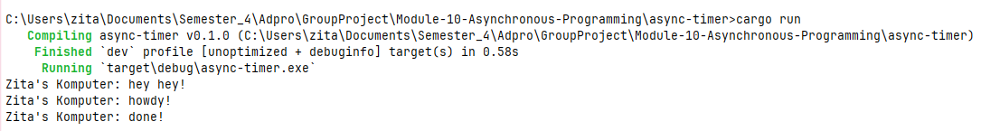
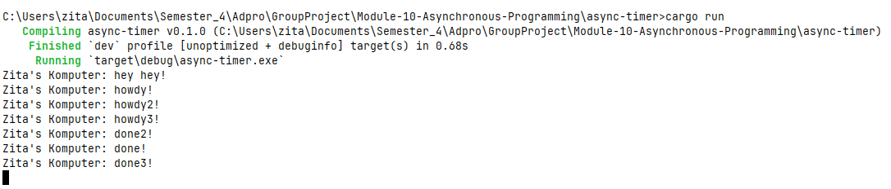
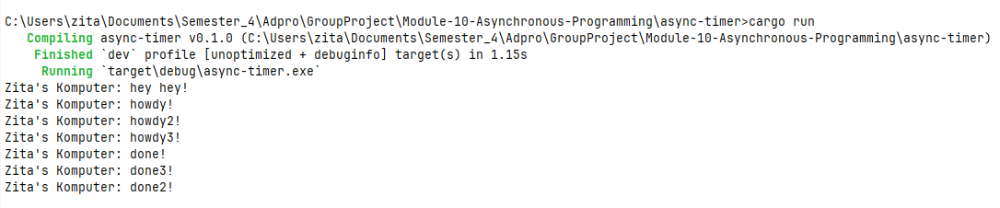
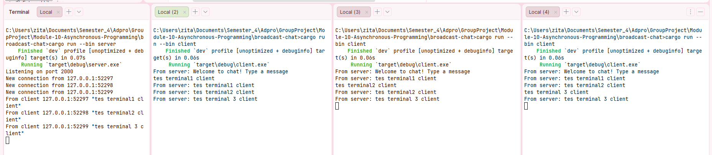
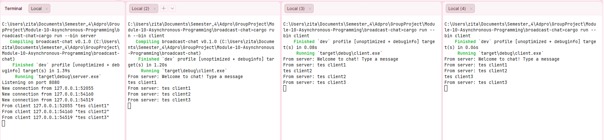
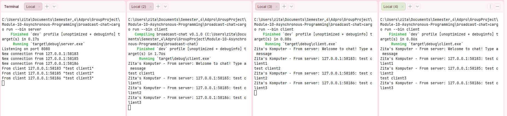
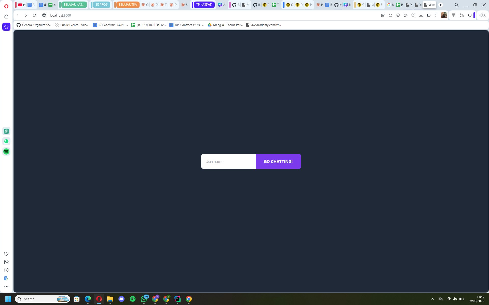
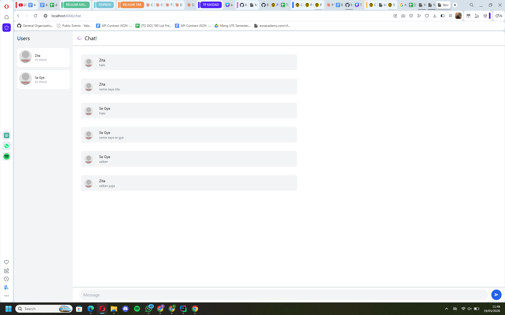
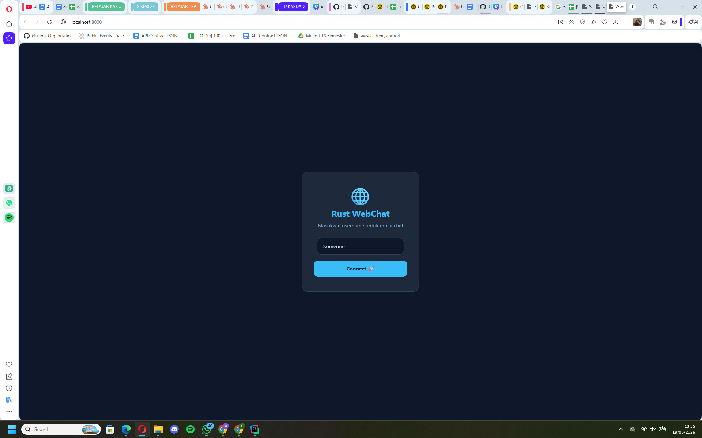
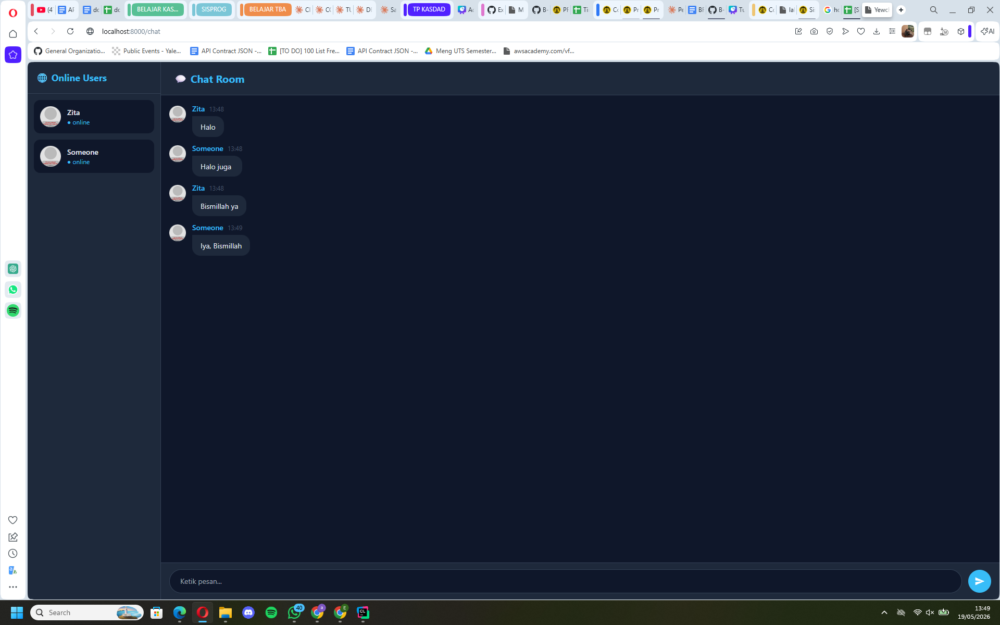

Nama: Zita Nayra Ardini
NPM: 2406404913
Kelas: Pemrograman Lanjut B

# TUTORIAL 1: Timer
## Eksperimen 1.2: Understanding how it works (Excutor)
### Screenshot:

### Penjelasan:
Ketika saya menambahkan println! setelah spawner.spawn(), ternyata output "hey hey!" muncul lebih dulu sebelum "howdy!". Hal ini terjadi karena spawner.spawn() hanya mendaftarkan future ke antrian executor, tetapi tidak langsung menjalankannya. Eksekusi sebenarnya baru terjadi ketika executor.run() dipanggil. Oleh karena itu, kode yang berada di luar blok async (yaitu println!("hey hey!")) dieksekusi secara sinkronus terlebih dahulu. Ini membuktikan bahwa future di Rust bersifat lazy: mereka tidak berjalan tanpa executor yang memanggil poll. Setelah executor.run() dijalankan, executor mengambil task dari antrian, memanggil poll, dan mencetak "howdy!". Kemudian timer berjalan 2 detik, dan setelah selesai mencetak "done!". Urutan ini menunjukkan pemisahan antara penjadwalan (spawn) dan eksekusi (poll) dalam model async Rust.

## Eksperimen 1.3: Multiple Spawn and removing drop
### Screenshot tanpa drop:

Program mencetak semua "howdy" dan "done", lalu hang (tidak berhenti). Harus dihentikan manual (Ctrl+C).

### Screenshot dengan drop:

### Penjelasan:
- Multiple spawn:
> Executor memanggil poll untuk setiap task secara bergantian. Pada polling pertama, semua task langsung mencetak "howdy", memulai timer masing-masing, lalu mengembalikan Pending. Setelah 2 detik, semua timer selesai hampir bersamaan, executor melanjutkan polling dan mencetak "done". Ini menunjukkan konkurensi yaitu tiga task berjalan overlapped dalam rentang waktu yang sama.

- Menghapus drop:
> Executor menggunakan while let Ok(task) = ready_queue.recv(). Fungsi recv() akan menunggu selama channel masih terbuka. Channel ditutup hanya ketika semua SyncSender (termasuk spawner) di-drop. Karena spawner tidak di-drop, executor terus menunggu task baru meskipun antrian kosong. Akibatnya program tidak pernah berhenti.

# TUTORIAL 2: Broadcast Chat
## Eksperimen 2.1: Original code of broadcast chat
### Screenshot:

### Penjelasan:
Server menggunakan TcpListener untuk menerima koneksi, lalu setiap koneksi di‑upgrade ke WebSocket dan ditangani oleh task terpisah dengan tokio::spawn. Di dalam fungsi handle_connection, terdapat tokio::select! yang menunggu dua kejadian yaitu pesan masuk dari client yang akan dikirim ke broadcast::Sender sehingga semua subscriber (client lain) menerimanya, serta pesan dari broadcast channel yang akan dikirim ke client yang bersangkutan. Dengan mekanisme ini, server dapat menangani banyak client secara konkuren tanpa perlu multi‑threading manual. Broadcast channel dengan buffer 16 pesan (channel(16)) dan setiap client memiliki subscribe() sendiri merupakan pola publish‑subscribe yang sangat efisien untuk aplikasi chat.

## Eksperimen 2.2: Modifying the websocket port
### Screenshot:

### Penjelasan:
Server berjalan di port 8080, client terhubung ke port 8080. Chat tetap berfungsi normal. Komunikasi client-server menggunakan protokol WebSocket di atas TCP. Port adalah pintu masuk di sisi server. Server harus bind ke suatu port, dan client harus connect ke port yang sama. Jika port tidak sama, koneksi akan gagal dengan error connection refused. Perubahan hanya pada literal angka port, karena protokol tetap ws://. Tidak ada kode lain yang perlu dimodifikasi karena alamat host (127.0.0.1) masih sama. Eksperimen ini mengajarkan pentingnya konsistensi konfigurasi jaringan antara server dan client. Setelah perubahan, server mendengarkan di port 8080, dan client menunjuk ke port tersebut, sehingga komunikasi berjalan mulus.

## Eksperimen 2.3: Small changes. Add some information to client
### Screenshot:

### Penjelasan:
Parameter addr (bertipe SocketAddr) hanya tersedia di server dari listener.accept(). Server mengetahui alamat IP dan port setiap client yang terhubung. Sementara itu, client tidak memiliki informasi tentang alamat client lain. Oleh karena itu, penambahan informasi pengirim harus dilakukan di sisi server sebelum pesan di-broadcast. Dengan memformat ulang pesan menjadi "{addr}: {msg}", setiap client dapat melihat siapa pengirim asli berdasarkan alamatnya. Ini berguna untuk transparansi dalam chat room tanpa sistem login. Selain itu, dengan menampilkan port, kita bisa membedakan beberapa client dari komputer yang sama (karena port berbeda). Perubahan ini menunjukkan bagaimana kita bisa memanfaatkan informasi koneksi TCP untuk memperkaya pengalaman pengguna.

# TUTORIAL 3: WebChat using Yew
## Eksperimen 3.1: Original code of web server
### Screenshot:

Setelah di clone, aplikasi bisa dijalankan dan beberapa user bisa saling berkomunikasi melalui web chat.

### Penjelasan:
Yew adalah framework Rust untuk frontend WebAssembly. Aplikasi Yew dikompilasi ke WASM dan dijalankan di browser. Komunikasi dengan server menggunakan WebSocket melalui crate web-sys. Client Yew mengirim pesan dalam bentuk JSON, dan server JavaScript hanya mem-broadcast pesan tersebut tanpa mengubahnya. Setiap client yang terhubung menerima pesan dan menampilkannya. Ini menunjukkan interoperabilitas antara Rust backend dan frontend Rust (WASM) dengan protokol yang sama. Keunggulan Yew adalah kita bisa menulis frontend dengan Rust, memanfaatkan type safety dan performa WASM. Ekosistem trunk memudahkan pengembangan dan live reload. Eksperimen ini menjadi dasar untuk modifikasi kreatif di eksperimen berikutnya.

## Eksperimen 3.2: Be Creative!
### Screenshot:

### Penjelasan:
Saya memodifikasi tampilan YewChat dengan menerapkan tema dark navy + cyan yang modern. Perubahan yang dilakukan meliputi redesain halaman login dengan card terpusat yang menampilkan ikon globe, judul, dan tombol Connect yang berubah warna secara dinamis tergantung apakah username sudah diisi atau belum. Pada halaman chat, saya mengubah layout menjadi dua panel dimana sidebar kiri untuk daftar user online dengan indikator status, dan panel kanan untuk area percakapan dengan bubble pesan yang lebih rapi menggunakan rounded card design.
Selain perubahan visual, saya juga menambahkan fitur timestamp pada setiap pesan dalam format HH:MM yang di-generate di sisi client menggunakan js_sys::Date. Hal ini membuat aplikasi lebih fungsional karena pengguna dapat mengetahui kapan sebuah pesan dikirim. Pemilihan warna gelap (#0f172a) dengan aksen cyan (#38bdf8) terinspirasi dari aplikasi chat modern seperti Discord, yang terbukti nyaman digunakan dalam waktu lama karena mengurangi kelelahan mata.